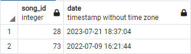

<h1 align="center">База данных музыкального стриминогового сервиса</h1>

<p align="center">


</p>

**Аннотация:**
_Основной целью данного проекта было создание базы данных для музыкального стримингового сервиса, чтобы автоматизировать процессы регистрации пользователей, прослушивания музыки, её сохранения и поиска новой, а также систематизации всех данных, требуемых для этих процессов. В качестве прототипа для данной работы послужил музыкальный стриминового сервис **[iTunes](https://www.apple.com/ru/itunes/)**._

---

**В данном проекте:**
Были созданы и логически связанны между собой необходимые таблицы, построенна диаграмма отношений таблиц, рассмотрены структуры некоторых таблиц, созданы сложные(многотабличные) запросы для получения определенного среза данных, несколько представлений, пользовательская функция, триггер и оптимизации запросов.

Автор проекта: [Denis Sazonov](https://github.com/Breakhead2)

## Анализ бизнес-логики

Данный музыкальный стрименговый сервис должен давать возможность зарегистрироваться пользователям, слушать музыку, сохранять её в своих плейлистах, находить новую, а также загружать свои собственные альбомы и треки. Для этого в базе данных приложения необходимо иметь информацию о пользователях, альбомах и песнях. Поэтому создадим необходимые таблицы.

## Создание таблиц

### Таблица «Пользователи»

Таблица _«Пользователи»_ предназначена для хранения информации о пользователе, а именно:

- **имя**
- **фамилия**
- **email**
- **телефон**

Для создание таблицы в СУБД **PostgreSQL** воспользуемся следующей командой:

```sql
CREATE TABLE users (
	id SERIAL PRIMARY KEY,
	first_name VARCHAR(50) NOT NULL,
	last_name VARCHAR(50) NOT NULL,
	email VARCHAR(120) NOT NULL UNIQUE,
	phone VARCHAR(30) UNIQUE
);

```

### Таблица «Профили»

Таблица _«Профили»_ предназначена для хранения дополнительной информации о пользователе, а именно:

- **идентификатор пользователя**
- **имя файла фотографии**
- **роль**
- **дата создания**

Для создание таблицы воспользуемся уже известной нам командой:

```sql
CREATE TABLE profiles (
	user_id INT NOT NULL,
	photo_filename VARCHAR(50) DEFAULT 'default.png',
	user_role_id INT NOT NULL,
	created_at TIMESTAMP,
	PRIMARY KEY (user_id)
);
```

Как видно из кода, для поля **photo_filename** задано значение по умолчанию `default.png`

### Таблица «Роли»

Таблица _«Роли»_ предназначена для хранения информации о роли пользователя, это может быть слушатель или владелец.

Создадим таблицу:

```sql
CREATE TABLE roles (
	id SERIAL PRIMARY KEY,
	name VARCHAR(10) NOT NULL
);
```

### Таблица «Альбомы»

Таблица _«Альбомы»_ предназначена для хранения информации об альбоме, а именно:

- **название альбома**
- **автор**
- **имя файла обложки альбома**
- **url**
- **дата релиза**
- **дата загрузки**

Создадим таблицу:

```sql
CREATE TABLE albums (
	id SERIAL PRIMARY KEY,
	name VARCHAR(100) NOT NULL,
	author VARCHAR(100) NOT NULL,
	cover_filename VARCHAR(50) DEFAULT 'no_cover.png',
	url VARCHAR(100) NOT NULL UNIQUE,
	realese_data TIMESTAMP,
	upload_data TIMESTAMP
);
```

### Таблица «Песни»

Таблица _«Песни»_ предназначена для хранения информации о песни, а именно:

- **название песни**
- **исполнитель**
- **жанр**
- **url**
- **количество прослушиваний**

Создадим таблицу:

```sql
CREATE TABLE songs (
	id SERIAL PRIMARY KEY,
	name VARCHAR(100) NOT NULL,
	singer VARCHAR(100) NOT NULL,
	genre_id INT NOT NULL,
	url VARCHAR(100) NOT NULL UNIQUE,
	listening_counter INT DEFAULT 0
);
```

### Таблица «Жанры»

Таблица _«Жанры»_ предназначена для хранения информации о жанре песни, это может быть рок, классическая музыка, рэп, поп-музыка, электронная и другие.

Создадим таблицу:

```sql
CREATE TABLE genres (
	id SERIAL PRIMARY KEY,
	name VARCHAR (20) NOT NULL
);
```

### Таблица «Подписки»

Таблица _«Подписки»_ предназначена для хранения информации о том на кого подписан пользователь, это может быть другой пользователь, который пишет свои песни и музыка или музыкальные лейблы зарегестрированные в данном сервисе.

Создадим таблицу:

```sql
CREATE TABLE subscriptions (
	id SERIAL PRIMARY KEY,
	by_user_id INT NOT NULL,
	to_user_id INT NOT NULL,
	signed_at TIMESTAMP
);
```

### Таблица «Плейлисты»

Таблица _«Плейлисты»_ предназначена для хранения информации о плейлисте, а именно:

- **имя плейлиста**
- **идентификатор создателя**
- **дата создания**

Создадим таблицу:

```sql
CREATE TABLE playlists (
	id SERIAL PRIMARY KEY,
	name VARCHAR(50) NOT NULL,
	creator_id INT NOT NULL,
	created_at TIMESTAMP
);
```

### Таблица связи «Плейлисты-Песни»

Таблица _«Плейлисты-Песни»_ предназначена для предоставлении информации о песнях и плейлистах, в которые они были добавлены.

Создадим таблицу связи:

```sql
CREATE TABLE playlists_songs (
	playlist_id INT NOT NULL,
	song_id INT NOT NULL
);
```

### Таблица «История прослушивания»

Таблица _«История прослушивания»_ предназначена для предоставлении информации о песнях прослушенных пользователем.

Создадим таблицу:

```sql
CREATE TABLE listening_history (
	user_id INT NOT NULL,
	song_id INT NOT NULL,
	date TIMESTAMP
);
```

### Таблица связи «Альбомы-Песни»

Таблица _«Альбомы-Песни»_ предназначена для предоставлении информации о том, какая песня принадлежат альбому.

Создадим таблицу связи:

```sql
CREATE TABLE albums_songs (
	album_id INT NOT NULL,
	song_id INT NOT NULL
);
```

### Таблица связи «Альбомы-Пользователи»

Таблица _«Альбомы-Пользователи»_ предназначена для предоставлении информации о том, какой альбом добавил себе пользователь.

Создадим таблицу связи:

```sql
CREATE TABLE albums_users (
	album_id INT NOT NULL,
	user_id INT NOT NULL
);
```

### Таблица связи «Песни-Пользователи»

Таблица _«Песни-Пользователи»_ предназначена для предоставлении информации о том, какую песню добавил себе пользователь.

Создадим таблицу связи:

```sql
CREATE TABLE songs_users (
	song_id INT NOT NULL,
	user_id INT NOT NULL
);
```

## Генерация данных

Для генерации данных наших таблиц воспользуемся сервисом [_generatedata.com_](https://generatedata.com/).
Дамп базы данных с тестовыми данными находится в репозитории под именем [_itunes.dump.sql_](https://github.com/Breakhead2/itunesDB_project/blob/main/itunes.dump.sql) или можного его скачать с [_google drive_](https://drive.google.com/file/d/1W5_jGxPoOmsPJI6FotMgRoBLtDbiAByd/view?usp=sharing).

## Создание внешних ключей

На текущий момент таблицы базы данных связаны между собой на логическом уровне с помощью столбцов связи. Но сама база данных об этих связях пока что ничего не знает. Для того чтобы определить связи формальным образом, нам необходимо создать внешние ключи, в которых значения столбца связи ссылаются на значения первичного ключа другой таблицы.

### Внешние ключи таблицы «Профили»

Связываем колонку _user_id_ с таблицей _«Пользователи»_ и колонку _user_role_id_ с таблицей _«Роли»_.

```sql
ALTER TABLE profiles
ADD CONSTRAINT profiles_user_id_fk
FOREIGN KEY (user_id)
REFERENCES users (id);

ALTER TABLE profiles
ADD CONSTRAINT profiles_user_role_id_fk
FOREIGN KEY (user_role_id)
REFERENCES roles (id);
```

### Внешние ключи таблицы «Песни»

Связываем колонку _genre_id_ c таблицей _«Жанры»_.

```sql
ALTER TABLE songs
ADD CONSTRAINT songs_genre_id_fk
FOREIGN KEY (genre_id)
REFERENCES genres (id);
```

### Внешние ключи таблицы «Подписки»

Связываем колонки _by_user_id_ и _to_user_id_ c таблицей _«Пользователи»_.

```sql
ALTER TABLE subscriptions
ADD CONSTRAINT subscriptions_by_user_id_fk
FOREIGN KEY (by_user_id)
REFERENCES users (id);

ALTER TABLE subscriptions
ADD CONSTRAINT subscriptions_to_user_id_fk
FOREIGN KEY (to_user_id)
REFERENCES users (id);
```

### Внешние ключи таблицы «Плейлисты»

Связываем колонку _creator_id_ с таблицей _«Пользователи»_.

```sql
ALTER TABLE playlists
ADD CONSTRAINT playlists_creator_id_fk
FOREIGN KEY (creator_id)
REFERENCES users (id);
```

### Внешние ключи таблицы связи «Плейлисты - Песни»

Связываем колонку _playlist_id_ с таблицей _«Плейлисты»_ и колонку _song_id_ с таблицей _«Песни»_.

```sql
ALTER TABLE playlists_songs
ADD CONSTRAINT playlists_songs_playlist_id_fk
FOREIGN KEY (playlist_id)
REFERENCES playlists (id);

ALTER TABLE playlists_songs
ADD CONSTRAINT playlists_songs_song_id_fk
FOREIGN KEY (song_id)
REFERENCES songs (id);
```

### Внешние ключи таблицы «История прослушивания»

Связываем колонку _user_id_ с таблицей _«Пользователи»_ и колонку _song_id_ с таблицей _«Песни»_.

```sql
ALTER TABLE listening_history
ADD CONSTRAINT listening_history_user_id_fk
FOREIGN KEY (user_id)
REFERENCES users (id);

ALTER TABLE listening_history
ADD CONSTRAINT listening_history_song_id_fk
FOREIGN KEY (song_id)
REFERENCES songs (id);
```

### Внешние ключи таблицы связи «Альбомы - Песни»

Связываем колонку _album_id_ с таблицей _«Альбомы»_ и колонку _song_id_ с таблицей _«Песни»_.

```sql
ALTER TABLE albums_songs
ADD CONSTRAINT albums_songs_album_id_fk
FOREIGN KEY (album_id)
REFERENCES albums (id);

ALTER TABLE albums_songs
ADD CONSTRAINT albums_songs_song_id_fk
FOREIGN KEY (song_id)
REFERENCES songs (id);
```

### Внешние ключи таблицы связи «Альбомы - Пользователи»

Связываем колонку _album_id_ с таблицей _«Альбомы»_ и колонку _user_id_ с таблицей _«Пользователи»_.

```sql
ALTER TABLE albums_users
ADD CONSTRAINT albums_users_album_id_fk
FOREIGN KEY (album_id)
REFERENCES albums (id);

ALTER TABLE albums_users
ADD CONSTRAINT albums_users_user_id_fk
FOREIGN KEY (user_id)
REFERENCES users (id)
```

### Внешние ключи таблицы связи «Песни - Пользователи»

Связываем колонку _song_id_ с таблицей _«Песни»_ и колонку _user_id_ с таблицей _«Пользователи»_.

```sql
ALTER TABLE songs_users
ADD CONSTRAINT songs_users_song_id_fk
FOREIGN KEY (song_id)
REFERENCES songs (id);

ALTER TABLE songs_users
ADD CONSTRAINT songs_users_user_id_fk
FOREIGN KEY (user_id)
REFERENCES users (id);
```

## Диаграмма отношений

Так как мы уже физически создали внешние ключи для таблиц, мы можем визуально увидить связи между ними. Для этого создадим диаграмму отношений и получим результат:

<p align="center">


</p>

## Сложные запросы

### Сложные запросы с использованием подзапросов

Создадим два сложных некоррелирующих запроса с использованием подзапроса для нашей системы. Для начала выведем топ 10 прослушиваемых песен в жанре "рок".

В выборке будем выводить исполнителя, название песни и количество прослушиваний.

```sql
SELECT
   singer,
   name as song_name,
   listening_counter
   FROM songs
   WHERE genre_id = (SELECT id FROM genres WHERE name = 'rock')
ORDER BY listening_counter DESC
LIMIT 10;
```

И получим следущий результат:

<p align="center">


</p>

Теперь выведем историю прослушивания песен пользователя и отсортируем их по дате.

В выборке будем выводить идентификатор песни и дату прослушивания.

```sql
SELECT
   song_id,
   date
   FROM listening_history
   WHERE user_id = (SELECT id FROM users WHERE first_name = 'Bert' AND last_name = 'Hopkins')
ORDER BY date DESC
LIMIT 10;
```

Получим следующий результат:

<p align="center">



</p>

### Сложные запросы с использованием объединения JOIN и без использования подзапросов

Создадим два сложных запроса с использованием объединения JOIN и без использования подзапросов.
Выведем 10 самых популярных песен у пользователя.

В выборке будем выводить исполнителя, название песни и количество прослушиваний.

```sql
SELECT
   songs.singer as songs_singer,
   songs.name as songs_name,
   songs.listening_counter as listening_counter
   FROM songs_users
      JOIN songs ON songs_users.song_id = songs.id
      LEFT JOIN users ON songs_users.user_id = users.id
   WHERE users.first_name = 'Riley' AND users.last_name = 'Farmer'
ORDER BY songs.listening_counter DESC
LIMIT 10;
```

Получим следующий результат:

<p align="center">


</p>

Теперь выведем список альбомов пользователя отсортированных по дате релиза.

```sql
SELECT
   albums.name as album,
   albums.author as author,
   albums.realese_data as realese_data
   FROM albums_users
      JOIN albums ON albums_users.album_id = albums.id
      LEFT JOIN users ON albums_users.user_id = users.id
   WHERE users.first_name = 'Riley' AND users.last_name = 'Farmer'
ORDER BY albums.realese_data DESC
LIMIT 10;
```

Получим следующий результат:

<p align="center">


</p>

## Представления

Создадим представление _"список прослушиваемых плейлистов"_.

В выборке будем выводить идентификатор плейлиста, количество песен в нем
и общее количество прослушиваний песен в плейлисте.

```sql
CREATE VIEW list_of_listening_playlists AS
SELECT
   playlist_id,
   COUNT(song_id) as quantity_songs,
   SUM(songs.listening_counter) as total_listening
   FROM playlists_songs
      JOIN songs ON playlists_songs.song_id = songs.id
GROUP BY playlist_id;
```

Представление создалось, посмотрим на него, выполнив команду:

```sql
SELECT * FROM list_of_listening_playlists;
```

Получим следующий результат:

<p align="center">


</p>

<p1 align="center">

Это список плейлистов сгрупированных по идентификатору.

</p1>

Теперь используя представление _"список прослушиваемых плейлистов"_, можно создать новое представление _"самые популярные плейлисты"_ подключив таблицу плейлистов и пользователей.

В выборке будем выводить информацию о владельце плейлиста, имени плейлиста, кол-во песен в плейлисте, общее количество прослушиваний песен и дату создания плейлиста.

```sql
CREATE VIEW most_popular_playlists AS
SELECT
   users.first_name as owner_playlist,
   playlists.name as playlist_name,
   quantity_songs,
   total_listening,
   playlists.created_at
   FROM list_of_listening_playlists
      JOIN playlists ON list_of_listening_playlists.playlist_id = playlists.id
      LEFT JOIN users ON playlists.creator_id = users.id
ORDER BY total_listening DESC;
```

Представление создалось, посмотрим на него, выполнив команду:

```sql
SELECT * FROM most_popular_playlists;
```

Получим результат:

<p align="center">


</p>

## Пользовательские функции

Напишем функцию, которая находит идентификатор наиболее активного пользователя,
который прослушал наибольшее количество песен за месяц.

```sql
CREATE OR REPLACE FUNCTION most_active_user_for_a_month()
RETURNS INTEGER AS
$$
   SELECT user_id
   FROM listening_history
   WHERE date  <= now() AND date >= now() - INTERVAL '30 DAY'
   GROUP BY user_id
   ORDER BY COUNT(song_id) DESC
   LIMIT 1;
$$
LANGUAGE SQL;
```

Выполним данную функцию:

```sql
SELECT * FROM most_active_user_for_a_month();
```

Получим результат:

<p align="center">


</p>

## Триггер

Реализум триггер на проверку существует ли пользователь в базе данных при создании плейлиста. Если такой пользователь существует то создаем плейлист, если нет выдаем ошибку "Такого пользователя не существует. Перепроверьте данные".

Для начала напишем функцию проверки существует ли пользователь в базе данных.

```sql
CREATE OR REPLACE FUNCTION checking_user()
RETURNS TRIGGER AS
$$
DECLARE is_user BOOLEAN;
BEGIN
   IF NOT EXISTS (SELECT users.id FROM users WHERE id = NEW.creator_id)
   THEN
      RAISE EXCEPTION 'Sorry. This user doesnt exists.Rechecking your arguments';
   END IF;
   RETURN NEW;
END;
$$
LANGUAGE PLPGSQL;
```

Затем создадим триггер на наличие прав для создание плейлиста.

```sql
CREATE TRIGGER checking_permisson_on_create_playlist
BEFORE INSERT ON playlists
FOR EACH ROW
EXECUTE FUNCTION checking_user();
```

Проверим работу нашего триггера, попробуем создать плейлист от несуществующего пользователя.

```sql
INSERT INTO playlists (name, creator_id, created_at) VALUES ('new playlist', 101, NOW());
```

СУБД выдаст нам ошибку:

_ERROR: Sorry. This user doesnt exists.Rechecking your arguments_

## Оптимизация запросов

Рассмотрим эффективность ранее выполненых сложных запросов с использованием объединения JOIN и попробуем их проанализировать и оптимизировать.

Я буду разбирать запрос на 10 самых популярых песен у пользователя.

Для начала посмотрим на _актуальный_ план построения запроса и разберем его, выполнив команду:

```sql
EXPLAIN ANALYZE SELECT
	songs.singer as songs_singer,
	songs.name as songs_name,
	songs.listening_counter as listening_counter
	FROM songs_users
		JOIN songs ON songs_users.song_id = songs.id
		LEFT JOIN users ON songs_users.user_id = users.id
	WHERE users.first_name = 'Riley' AND users.last_name = 'Farmer'
ORDER BY songs.listening_counter DESC
LIMIT 10;
```

В результате выполнения команды получим древовидную структуру запроса, состоящую из узлов, где каждый узел соотвествует определенной части запроса.

```sql
                                                             QUERY PLAN
-------------------------------------------------------------------------------------------------------------------------------------
 Limit  (cost=6.12..6.12 rows=1 width=38) (actual time=0.099..0.101 rows=3 loops=1)
   ->  Sort  (cost=6.12..6.12 rows=1 width=38) (actual time=0.098..0.100 rows=3 loops=1)
         Sort Key: songs.listening_counter DESC
         Sort Method: quicksort  Memory: 25kB
         ->  Nested Loop  (cost=3.66..6.11 rows=1 width=38) (actual time=0.070..0.093 rows=3 loops=1)
               ->  Hash Join  (cost=3.51..5.79 rows=1 width=4) (actual time=0.062..0.079 rows=3 loops=1)
                     Hash Cond: (songs_users.user_id = users.id)
                     ->  Seq Scan on songs_users  (cost=0.00..2.00 rows=100 width=8) (actual time=0.007..0.015 rows=100 loops=1)
                     ->  Hash  (cost=3.50..3.50 rows=1 width=4) (actual time=0.034..0.034 rows=1 loops=1)
                           Buckets: 1024  Batches: 1  Memory Usage: 9kB
                           ->  Seq Scan on users  (cost=0.00..3.50 rows=1 width=4) (actual time=0.011..0.030 rows=1 loops=1)
                                 Filter: (((first_name)::text = 'Riley'::text) AND ((last_name)::text = 'Farmer'::text))
                                 Rows Removed by Filter: 99
               ->  Index Scan using songs_pkey on songs  (cost=0.14..0.32 rows=1 width=42) (actual time=0.003..0.003 rows=1 loops=3)
                     Index Cond: (id = songs_users.song_id)
 Planning Time: 0.394 ms
 Execution Time: 0.138 ms
```

### Анализ запроса

Видим, что планируемое время выполнения запроса _(Planning Time)_ значительно больше актуального _(Execution Time)_, так же видим отличия в общей стоимости запроса и количестве выводимых строк:

- _(cost=**6.12..6.12** rows=**1** width=38)_ - планируемая,
- _(actual time=**0.099..0.101** rows=**3** loops=1)_ - действительная.

Проанализируем узлы запроса по актуальной информации, не обращая внимание на ожидаемые данные.

#### Рассмотрим узел выборки по таблице «Пользователи» с фильтрацией по имени и фамилии

```sql
->  Seq Scan on users  (cost=0.00..3.50 rows=1 width=4) (actual time=0.011..0.030 rows=1 loops=1)
      Filter: (((first_name)::text = 'Riley'::text) AND ((last_name)::text = 'Farmer'::text))
      Rows Removed by Filter: 99
```

Проанализируем узел:

- используется последовательное сканирование _Seq Scan_ по таблице _«Пользователи»_, что в данной ситуации плохо, так как нам нужна всего одна строка;

- актуальная стоимость подготовки запроса равна 0.011, актуальная стоимость выполнения запроса равна 0.030;

- выбрана 1 строка.

#### Рассмотрим узел выборки по таблице связи «Песни - Пользователи»

```sql
->  Seq Scan on songs_users  (cost=0.00..2.00 rows=100 width=8) (actual time=0.007..0.015 rows=100 loops=1)
Hash  (cost=3.50..3.50 rows=1 width=4) (actual time=0.034..0.034 rows=1 loops=1)
  Buckets: 1024  Batches: 1  Memory Usage: 9kB
```

Проанализируем узел:

- используется последовательное сканирование _Seq Scan_ по таблице _«Песни - Пользователи»_, что нормально, так как нам нужны все строки;

- актуальная стоимость подготовки запроса равна 0.007, актуальная стоимость выполнения запроса равна 0.015;

- выбрано 100 строк.

#### Рассмотрим узел выборки по таблице связи «Песни»

```sql
->  Index Scan using songs_pkey on songs  (cost=0.14..0.32 rows=1 width=42) (actual time=0.003..0.003 rows=1 loops=3)
      Index Cond: (id = songs_users.song_id)
```

Проанализируем узел:

- используется индексное сканирование _Index Scan_ по таблице _«Песни»_, что хорошо;

- актуальная стоимость подготовки запроса равна 0.003, актуальная стоимость выполнения запроса равна 0.003;

- выбрано 1 строк.

#### Рассмотрим последний узел - узел сортировки

```sql
->  Sort  (cost=6.12..6.12 rows=1 width=38) (actual time=0.098..0.100 rows=3 loops=1)
      Sort Key: songs.listening_counter DESC
      Sort Method: quicksort  Memory: 25kB
```

Проанализируем узел:

- используется сортировка по ключу _songs.listening_counter_ от большего к меньшему.

- актуальная стоимость подготовки запроса равна 0.098, актуальная стоимость выполнения запроса равна 0.100;

- выбрано 3 строк.

### Оптимизация запроса

Исходя из проведенного анализа запроса, можно сделать вывод, что как минимум один узел работает плохо. Это узел выборки по таблице «Пользователи» с фильтрацией по имени и фамилии, так как там выборка данных осуществляется последовательным сканированием, при условии что нам нужна всего одна строка.

Для решения данной проблемы воспользуемся индексами. Создадим для колонок _имя_ и _фамилия_ таблицы _«Пользователи»_ составной индекс.

```sql
CREATE INDEX users_first_name_last_name_idx ON users (first_name, last_name);
```

Снова выполним актуальный план выполнения для нашего запроса и посмотрим результаты.

## Список команд используемых в данном проекте

- [_Команды создания таблиц_](./1_Create_tables_command.txt)
- [_Команды создание внешних ключей_](./2_Foreign_keys_command.txt)
- [_Команды создания сложных запросов с использованием подзапросов_](./3_Multytable_selects_without_JOIN.txt)
- [_Команды создания сложных запросов с использованием объединения JOIN и без использования подзапросов_](./4_Multytable_selects_with_JOIN.txt)
- [_Команды создания представлений_](./5_Views.txt)
- [_Команда создания пользовательской функции_](./6_Custom_function.txt)
- [_Команда создания триггера_](./7_Trigger.txt)
- [_Команда создания плана выполения запроса_](./8_Optimization_selects.txt)
